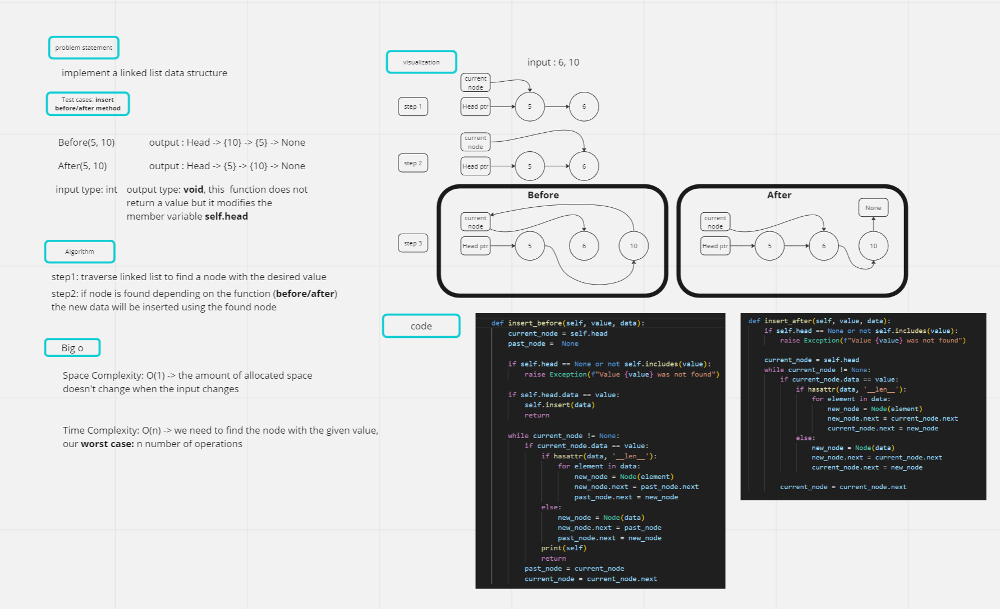
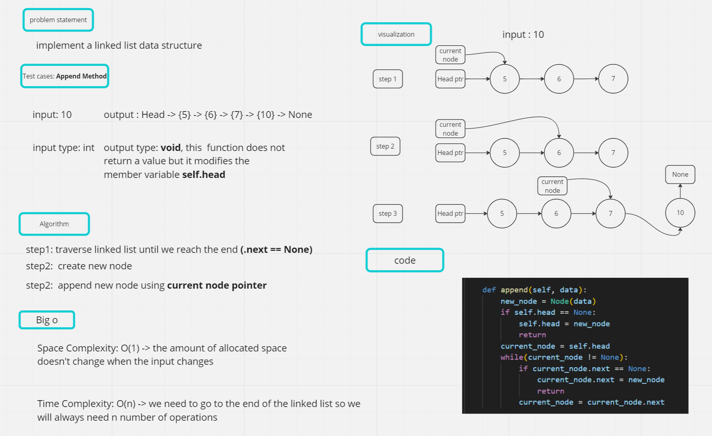

# linked-list

## Task: implement a linked list data structure

## 1. Whiteboard Process

### Insert **Before** and **After**



### Append



## 2. Approach & Efficiency

### Approach

* The code defines a ```Node``` class that represents a single node in a linked list, with a data attribute and a next pointer to the next node.
It then defines a ```linked_list``` class that represents the linked list, with methods for inserting new nodes, checking if a value exists in the list, appending a new node to the end of the list, inserting a new node before a specified value, and inserting a new node after a specified value.

* The ```linked list``` is implemented using a head node that points to the first node in the list.

### Efficiency

* The ```insert``` method has a time complexity of O(n) when inserting a list of length n, since it has to traverse the list to insert each element.

* The ```includes``` method has a time complexity of O(n) in the worst case, since it has to traverse the entire list to check if a value exists.

* The ```append``` method has a time complexity of O(n), since it has to traverse the list to find the end.

* The ```insert_before``` and ```insert_after``` methods have a time complexity of O(n), since they have to traverse the list to find the specified value.

## 3. Solution

* The code defines a ```Node``` class and a ```linked_list``` class to implement a linked list.

* The ```linked_list``` class has methods to insert new nodes, check if a value exists in the list, append a new node to the end of the list, insert a new node before a specified value, and insert a new node after a specified value.

* The linked list is implemented using a head node that points to the first node in the list.
