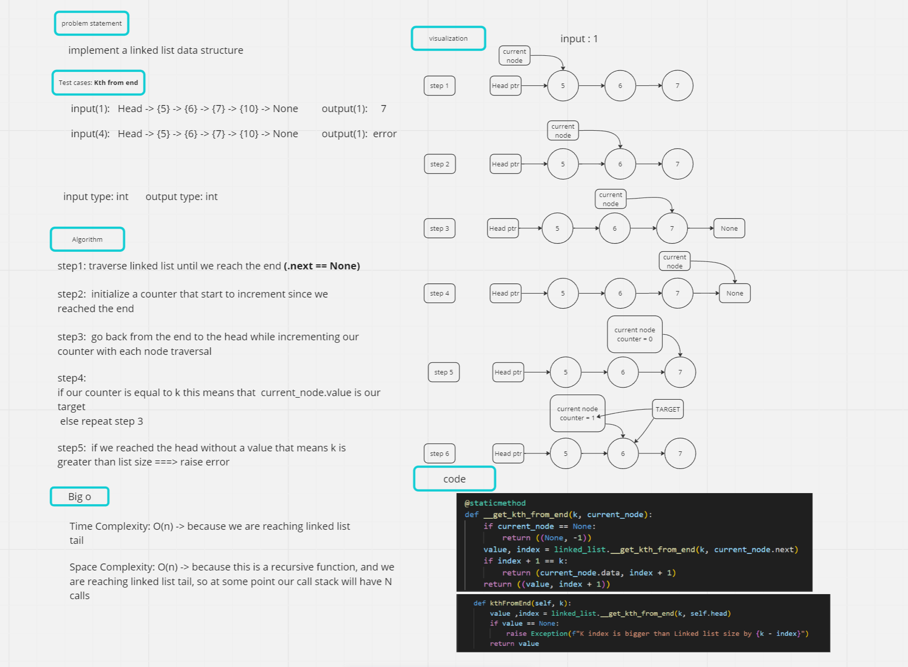

# linked-list

## Task: implement a linked list data structure

## 1. Whiteboard Process

### Kth from end



## 2. Approach & Efficiency

### Approach

* The approach used to find the ```k-th``` value from the end of a linked list is a recursive approach.

* It involves traversing the linked list recursively until reaching the end, and then tracking the index of each node encountered. By comparing the index to the desired ```k``` value, the ```k-th``` value from the end can be determined.

### Efficiency

* The **Time complexity** of finding the k-th value from the end of a linked list using this recursive approach is O(n), where n is the number of nodes in the linked list.

* This is because each node is visited once during the recursive traversal.

* The **Space complexity** of this approach is O(n) as well, due to the recursive function calls which create a call stack.

* In the worst case scenario, where k is equal to the length of the linked list, the call stack will have a depth of n.

## 3. Solution

* To find the ```k-th``` value from the end of a ```linked list```, you can call the ```kthFromEnd()``` method on an instance of the linked list class, passing the desired value of ```k```.

*The method will return the ```k-th``` value from the end if it exists, or raise an ```exception``` if k is greater than the length of the linked list.
