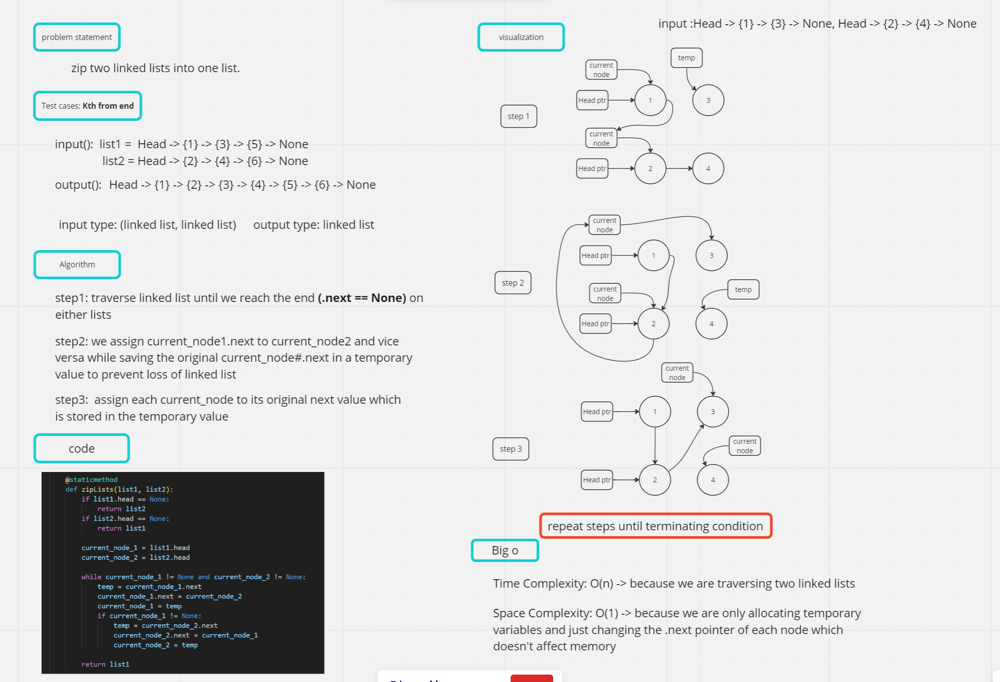

# linked-list

## Task: implement a linked list zip function

## 1. Whiteboard Process



## 2. Approach & Efficiency

### Approach

1. First, we handle the edge cases where one of the input lists is empty. If ```list1``` is empty, we return ```list2```, and if ```list2``` is empty, we return ```list1```.
2. We initialize two pointers, ```current_node_1``` and ```current_node_2```, to the heads of ```list1``` and ```list2``` respectively.
3. We iterate over the lists while both ```current_node_1``` and ```current_node_2``` are not None.
4. In each iteration, we perform the following steps:
    * Store the next node of ```current_node_1``` in a temporary variable temp.
    * Set the next pointer of ```current_node_1``` to ```current_node_2```, effectively merging ```current_node_2``` into ```list1```.
    * Move ```current_node_1``` to its next node (temp).
    * If ```current_node_1``` is not None, perform the same steps for ```current_node_2``` by swapping their roles.
5. After the loop, ```list1``` will contain the merged linked list.
6. Finally, we return ```list1```.

### Efficiency

* **Time complexity**: The function iterates through the linked lists once, so the time complexity is ```O(n)```, where n is the total number of nodes in the longer of the two input lists.

* **Space complexity**: The function only uses a constant amount of additional space for the temporary variables, so the space complexity is ```O(1)```.

## 3. Solution

* the solution iterates through both lists simultaneously, merging nodes from ```list2``` into ```list1``` in an alternating manner. This process continues until one of the lists is fully traversed. The resulting merged list is then returned as the final output.
