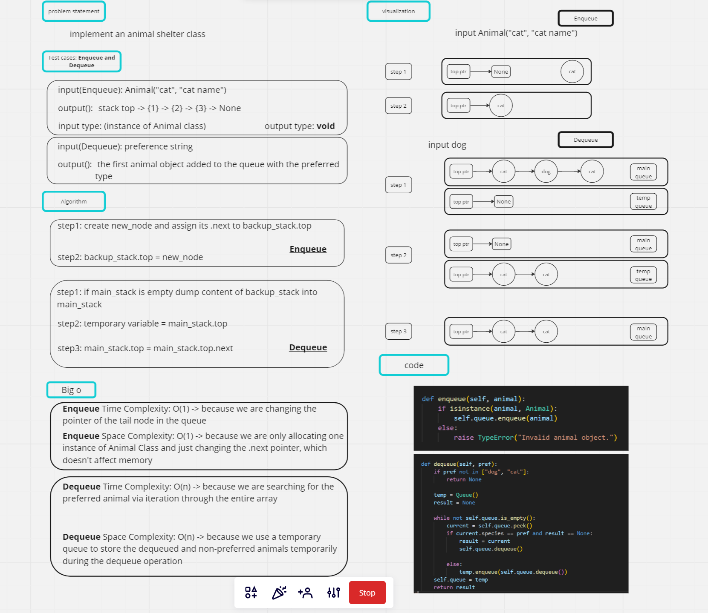

# stack queue pseudo

## Task: implement queue using stack data structure

## 1. Whiteboard Process



## 2. Approach & Efficiency

### Approach

Approach:

* The solution utilizes a linked list-based queue implementation for managing the animals in the shelter.
* The ```Node``` class represents a single node in the linked list, while the ```Queue``` class provides the queue functionality.
* The ```Animal``` class defines an animal with species and name attributes.
* The ```AnimalShelter``` class acts as the main interface for enqueueing and dequeueing animals in the shelter.

### Efficiency

* Enqueueing an animal takes ```O(1)``` time complexity since it involves inserting a new node at the back of the queue.
* Dequeueing an animal based on preference takes ```O(n)``` time complexity in the worst case, where n is the number of animals in the queue.
* The solution uses an additional temporary queue to store the dequeued and non-preferred animals temporarily during the dequeue operation, resulting in a trade-off between time and space complexity.

## 3. Solution

* The enqueue method adds an animal object to the end of the queue using the enqueue method of the underlying Queue class.
* The dequeue method takes a preference (pref) argument and removes and returns the first animal in the queue that matches the preference.
* It uses a temporary queue (temp) to store animals temporarily while searching for the preferred animal.
* The dequeue operation iterates through the animals in the original queue, moving non-preferred animals to the temporary queue until the preferred animal is found.
* Finally, the temporary queue replaces the original queue, and the preferred animal is returned.
* If the preference is neither "dog" nor "cat," it returns None.
* The solution ensures that animals are dequeued in a first-in, first-out (FIFO) manner, maintaining the order of arrival in the shelter.
