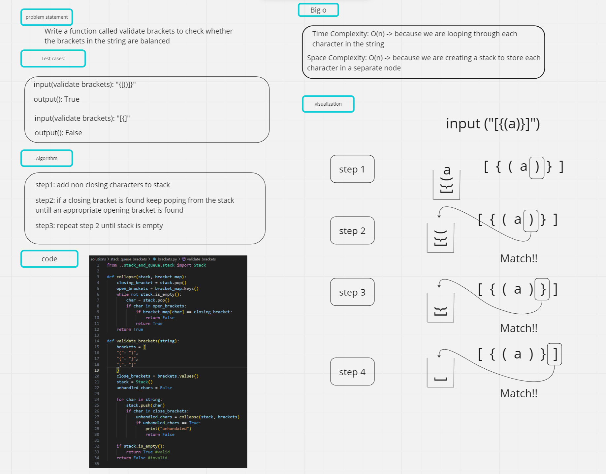

# stack queue pseudo

## Task: Write a function called validate brackets to check whether the brackets in the string are balanced

## 1. Whiteboard Process



## 2. Approach & Efficiency

### Approach

Approach:

* The code uses a ```stack``` data structure to validate brackets in a string.
* It iterates over each character in the string and pushes it onto the stack.
* If the character is a closing bracket, it checks if it can be collapsed with the topmost bracket in the stack.
* The ```collapse``` function is responsible for this check.
* If a closing bracket cannot be collapsed with a matching opening bracket, it returns False, indicating an invalid bracket sequence.
* After processing all characters, if the stack ```is_empty```, it means all brackets have been properly closed, and it returns True, indicating a valid bracket sequence.

### Efficiency

* The ***time complexity*** of this code is ```O(n)```, where n is the length of the input string.
* This is because it iterates over each character once and performs constant time operations such as pushing, popping, and checking if the stack is empty.
* The ***space complexity*** is also ```O(n)``` because the stack may hold up to n/2 brackets in the worst case.

## 3. Solution

* The code provides a solution to validate whether a given string contains a valid bracket sequence.
* It uses a stack to keep track of opening brackets and collapses them with closing brackets when encountered.
* If the stack is empty at the end of the iteration, it means all brackets have been properly closed, and the string is considered valid.
* Otherwise, if there are remaining brackets in the stack, it indicates an invalid sequence.
* The code handles different types of brackets: ```"("```,```"{"```, and ```"["``` and their corresponding closing brackets.
