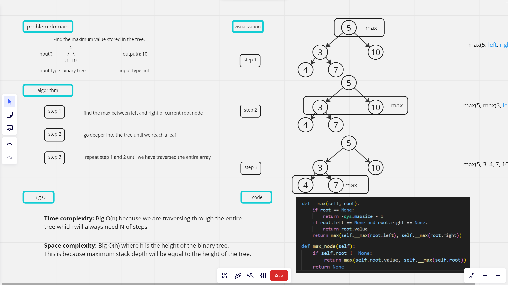

# stack queue pseudo

## Task: Find the maximum value stored in the tree

## 1. Whiteboard Process



## 2. Approach & Efficiency

### Approach

* The ```__max``` function follows a recursive approach to find the maximum value in a binary tree.
* It starts by checking if the root is None.

* If it is, the function returns a minimum value to handle the edge case. If the root has no left and right child nodes, it means it is a leaf node, and the function returns its value.

* Otherwise, the function recursively calls itself on the left and right child nodes and returns the maximum value between them.

* The ```max_node``` function checks if the binary tree has a root node.

* If it does, it returns the maximum value between the root value and the result of calling the ```__max``` function on the root. If the binary tree is empty, it returns None.

### Efficiency

* The time complexity of finding the maximum value in a binary tree using this approach is ```O(n)```, where n is the number of nodes in the tree.

* This is because the function needs to visit each node once to compare values and find the maximum.

* The space complexity is ```O(h)```, where h is the height of the binary tree.

* This is because the function uses the call stack to store intermediate results during the recursive calls, and the maximum stack depth will be equal to the height of the tree.

## 3. Solution

* two methods:```__max``` and ```max_node```. The``` __max``` method is a private recursive function that finds the maximum value in a binary tree. The max_node method returns the maximum value in the binary tree by calling the ```__max``` function.
